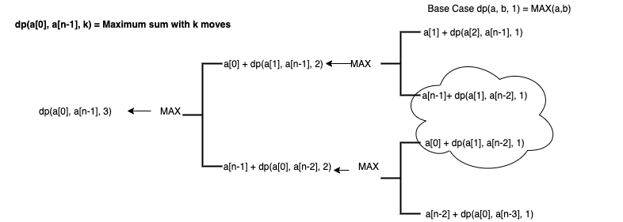
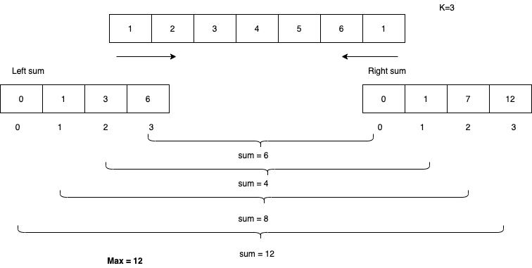
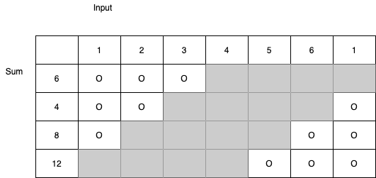

# Problem

[1423. Maximum Points You Can Obtain from Cards](https://https://leetcode.com/problems/maximum-points-you-can-obtain-from-cards/)

여러 개의 카드가 한 줄로 배열되어 있으며 각 카드에는 연관된 포인트 수가 있습니다. 
포인트는 정수 배열 cardPoints로 제공됩니다.
한번에 배열의 시작 또는 끝에서 한 장의 카드를 가져올 수 있습니다. 
정확히 k 장의 카드를 가져와야합니다.
당신의 점수는 당신이 가져간 카드의 점수의 합계입니다.
정수 배열 cardPoints와 정수 k가 주어지면 얻을 수있는 최대 점수를 Return 합니다.

Constraints:
1 <= cardPoints.length <= 10^5
1 <= cardPoints[i] <= 10^4
1 <= k <= cardPoints.length
```
Example 1:
Input: cardPoints = [1,2,3,4,5,6,1], k = 3
Output: 12
Explanation: After the first step, your score will always be 1. However, choosing the rightmost card first will maximize your total score. The optimal strategy is to take the three cards on the right, giving a final score of 1 + 6 + 5 = 12.
```


# Idea 1

##DP State 



##Implementation(memoization) - TLE!!
```
class Solution {
public:
    #define MAX(a,b) ((a)>(b))?(a):(b)
    
    int maxScore(vector<int>& cardPoints, int k) {
        int n = cardPoints.size();
        vector<vector<int>> mem(n,vector<int>(n,0));
        
        return helper(mem, cardPoints, 0, n-1, k);
    }
    
    int helper(vector<vector<int>> &mem, vector<int> &cardPoints, int l, int r, int k) {
        if(k==1)
            return MAX(cardPoints[l], cardPoints[r]);
        if(mem[l][r] != 0)
            return mem[l][r];
        
        int lresult = helper(mem, cardPoints, l+1, r, k-1);
        mem[l+1][r] = lresult;
        int left = cardPoints[l]+lresult;
        
        int rresult = helper(mem, cardPoints, l, r-1, k-1);
        mem[l][r-1] = rresult;
        int right = cardPoints[r]+rresult;
        
        int result = MAX(left, right);
        
        mem[l][r] = result;
        return result;
    }
};

```


# Idea 2



##Implementation(DP? prefix sum)
```
class Solution {
public:
    #define MAX(a,b) ((a)>(b))?(a):(b)
    
    int maxScore(vector<int>& cardPoints, int k) {
        vector<int> left(k,0);
        vector<int> right(k,0);
        
        int n = cardPoints.size();
        left[0] = cardPoints[0];
        right[0] = cardPoints[n-1];
        
        for(int i=1; i<k; i++) {
            
            left[i] = cardPoints[i] + left[i-1];
            right[i] = cardPoints[n-i-1] + right[i-1];
        }
        int result = MAX(left[k-1], right[k-1]);
        
        for(int i=0 ; i<k-1; i++) {
            int temp = left[i] + right[k-i-2];
                
            result = MAX(result, temp);
        }
        return result;
    }
};

```
# Complexity

```
O(N) O(N)
```


# Idea 3 - Sliding window



# Implementation

* [c](slidingwindow.c)
```
int maxScore(int* cardPoints, int cardPointsSize, int k){
    int max = 0;
    int cur = 0;
    int right;
    int left;

    for(right = 0; right < k; right++) {
            cur += cardPoints[right];
    }

    max = cur;
    right = k - 1;
    left = cardPointsSize - 1;

    while(right > -1) {
            cur -= cardPoints[right--];
            cur += cardPoints[left--];

            if (cur > max) {
                    max = cur;
            }
    }


    return max;
}


```

# Complexity

```
O(N) O(1)
```
