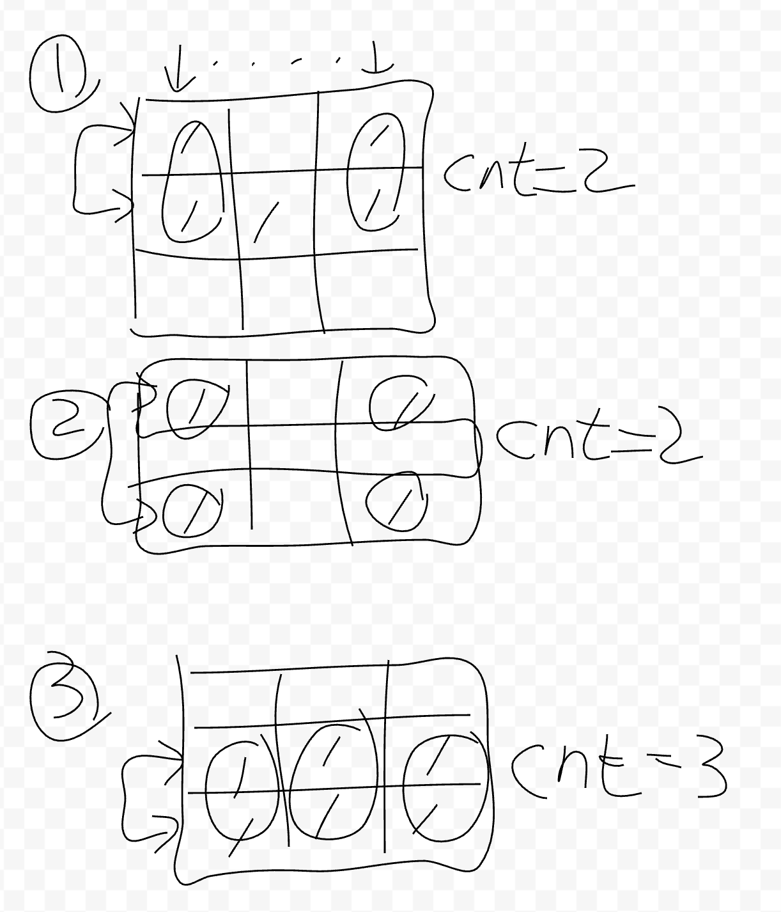

# 750. Number of corner rectangles

## Problem

## Solution

### Brute force

- 사각형을 확인하기 위해 2개의 y1=0, y2=y1+1 좌표 선택
- x 좌표를 이동하면서 두개의 좌표에 모두 1이 있는 것의 카운트 갯수를 구함
- 카운트된 갯수는 (count * (count -1))/2 계산으로 값을 변환
  - 해당 연산은 사각형의 벽면 갯수를 기준으로 조합가능한 사각형 갯수를 계산
  - 하나의 사각형의 두개의 양쪽 벽면을 가짐 : (2 * (2 - 1)) / 2 = 1
  - 두개의 사각형은 3개의 벽면을 가짐 : (3 * (3 - 1)) / 2 = 3
  - 세개의 사각형은 4개의 벽면을 가짐 : (4 * (4 - 1)) / 2 = 6 ...
- y2 를 증가하여 다시 두개의 좌표에 모두 1이 있는 갯수를 구함 (y2가 y의 최대까지)
- y1 을 증가하고, y2 = y1+1 로 좌표 선택하여 x 를 이동하며 갯수 구함 ...
- 모두 계산된 카운트 값을 합하면 정답

### DP
아몰랑~!

- dp 는 xy 변수를 y 로, x2 변수를 x 좌표로 처리하여 dp 메모리에 저장
- 기본 idea 는 y와 x(xy값) 좌표에서 값이 1 인 값만 처리. 0은 그냥 패스
- y, x(xy) 값이 1이면 xy 값에 1을 더해 x(x2) 좌표를 이동하며 1을 찾아냄.
- 1을 찾아내면 y(xy), x(x2) 좌표의 dp 값을 카운트 값에 합산하고 dp 값을 1 증가
- 최종적으로 카운트 값이 전체 사각형의 갯수
