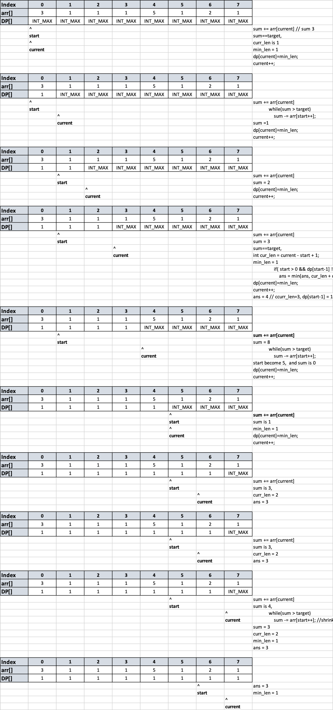

# Problem

[Find Two Non-overlapping Sub-arrays Each With Target Sum](https://leetcode.com/problems/find-two-non-overlapping-sub-arrays-each-with-target-sum/)

주어진 정수 array arr 와 정수 target에서,
target과 sum이 같은 non-overlapping한 sub-array들을 2개 찾으라. 
여러개의 answer 가 있을수 있으며,
두 sub-array들의 길이 합이 최소값인 것을 찾아서 return 하라. 
만약 없다면 -1을 return 해라 

Constraints:
1 <= arr.length <= 10^5
1 <= arr[i] <= 1000
1 <= target <= 10^8

# Idea

##Two pointer + array (dp ?)를 활용
DP[i] := min length of a valid subarray ends or before i.
```
1. Length N인 DP array를 생성하며, INT_MAX로 초기화 시킨다. 
2. 2 pointer, start =0 , current = 0			
3. sum = 0, curr_len = INT_MAX, ans = INT_MAX			
4. arr 를 탐색한다.  			
 	sum += arr[curr]		
 	while(sum>target)		
	    sum -= arr[start]		
	    start++;		
	if(sum==target)		
	    curr_len = curr - start +1		
	    if(start != 0 and dp[start-1] != INT_MAX) 
            // start 0인 경우와 dp[start-1] 인 경우는 subarray가 1개 이거나 없거나인 상태		
	       ans = min(ans, curr_len + dp[start-1] )		
	min_curr = min(min_curr, curr_len)		
5. ans가 INT_MAX일 경우(subarray가 없는 경우) -1을 return, 아니면 최소 합 ans를 return
```



# Implementation

* [c++11](FindTwoNonOverlappingSubArrayEachTargetSum.cpp)
```
class Solution {
public:
    int minSumOfLengths(vector<int>& arr, int target) {
        int n = arr.size();
        int ans = INT_MAX;
        vector<int> dp(n, INT_MAX); //dp[i] := min length of a valid subarray ends or before i.
        for(int current = 0, sum = 0, start=0, min_len = INT_MAX; current < n; current++){
            sum += arr[current];
            while(sum > target) 
                sum -= arr[start++]; //shrink from left, 'start'
            if(sum == target){                
                int cur_len = current - start + 1;
                
                if( start > 0 && dp[start-1] != INT_MAX)
                    ans = min(ans, cur_len + dp[start-1]);
                min_len = min(min_len, cur_len);
            }
            dp[current]=min_len;
        }        
        return ans < INT_MAX ? ans : -1;
    }
};

```

# Complexity

```
O(N) O(N)
```
